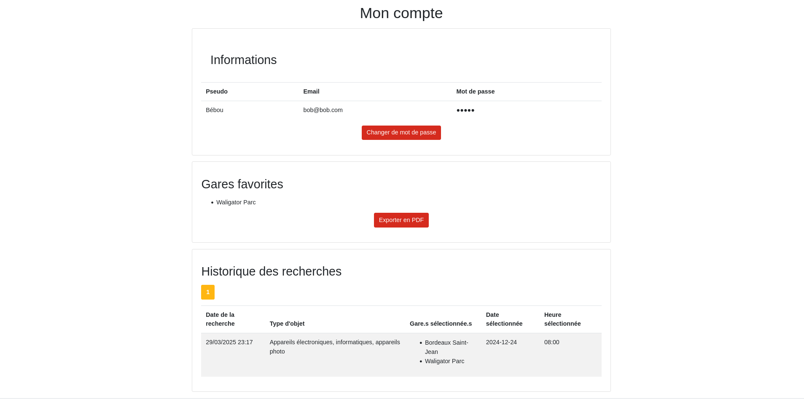
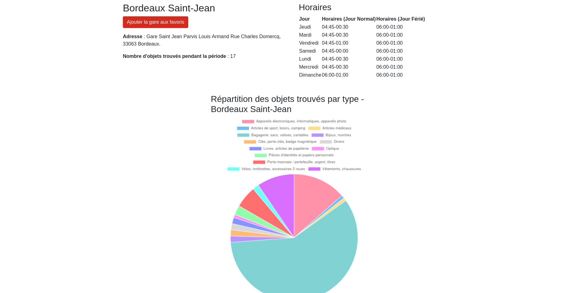
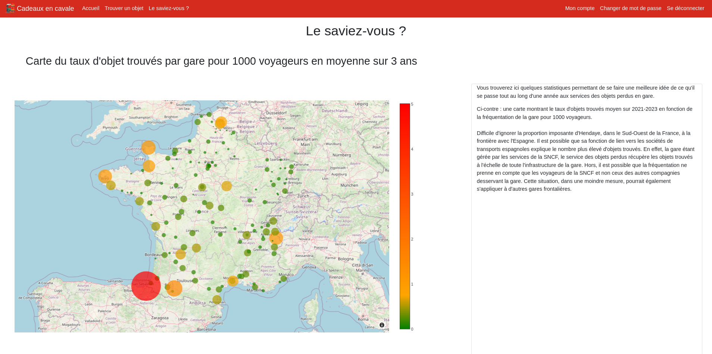

<a id="readme-top"></a>

[](https://github.com/Cateatspython/cadeauxencavale/graphs/contributors)
[](https://github.com/Cateatspython/cadeauxencavale/network/members)
[](https://github.com/Cateatspython/cadeauxencavale/issues)


<!-- PROJECT LOGO -->
<br />
<div align="center">
  <a href="https://github.com/Cateatspython/cadeauxencavale">
    
  </a>

<h3 align="center">Cadeaux en cavale</h3>

  <p align="center">
    Visualiser les objets perdus pendant les vacances de Noël dans les trains de la SNCF
  </p>
</div>


<!-- TABLE OF CONTENTS -->
<details>
  <summary>Table des matières</summary>
  <ol>
    <li>
      <a href="#about-the-project">À propos de ce projet</a>
    </li>
    <li><a href="#usage">Utilisation</a></li>
    <li><a href="#getting-started">Installation</a></li>
    <li><a href="#contributing">Contributeurs</a></li>
    <li><a href="#contact">Lien</a></li>
  </ol>
</details>


<!-- ABOUT THE PROJECT -->
<span id="about-the-project"></a>
## 🎁 À propos de ce projet

[![Product Name Screen Shot][product-screenshot]](https://example.com)

Retrouvez les cadeaux de Noël que vous avez perdus dans le train, localisez les gares où vous les avez égarés, apprenez-en davantage sur les pertes au moment des fêtes et découvrez les objets recherchés par les utilisateurs, tout cela en quelques clics !

<p align="right">(<a href="#readme-top">retour en haut</a>)</p>

<span id="usage"></a>
## 🎄 Utilisation

<!--description des fonctionnalités-->

Dans cette application, vous pouvez : 
* rechercher les objets perdus dans des gares choisies
* consulter les statistiques de pertes des objets dans les gares de France
* créer un compte pour enregistrer des gares favorites et son historique
* exporter sa liste de gares favorites !





<p align="right">(<a href="#readme-top">retour en haut</a>)</p>


<!-- GETTING STARTED -->
<span id="getting-started"></a>
## 🧑‍🎄 Installation

1. D'abord, si vous n'avez pas python : 
    - installer python en suivant <a href="https://www.docstring.fr/formations/faq/configuration/comment-installer-python-sur-mon-ordinateur/">ce tutoriel</a>
    - puis installer pip en suivant <a href="https://docs.python.org/fr/dev/installing/index.html">ce tutoriel</a>
2. Créer un dossier pour y stocker les fichiers de l'application, par exemple Application_cadeaux
3. Dans ce dossier, clôner à l'intérieur le dépôt github  :
  ```sh
  git clone git@github.com:Cateatspython/cadeauxencavale.git
  ```
2. Télécharger la base de données en .db et la mettre dans le dossier de l'application (ici Application_cadeaux)
3. Installer virtualenv
  ```sh
  python -m pip install --user virtualenv
  ```
5. Dans le terminal, créer un environnement virtuel avec virtualenv dabs le dossier de l'application (ici Application_cadeaux), en le nommant par exemple env_cadeaux :
  ```sh
  virtualenv env_cadeaux
  ```
7. Lancer l'environnement virtuel :
  ```sh
  source env_cadeaux/bin/activate
  ```
9. Dans le dossier du dépôt git cadeauxencavale, créer le fichier .env et y coller le contenu suivant :
  ```sh
  RESOURCES_PER_PAGE=10
  SQLALCHEMY_DATABASE_URI=sqlite:////chemin/de/sa/base/de/donnees.db
  DEBUG=False
  SECRET_KEY = inserer_clef_secrete_choisie
  SQLALCHEMY_ECHO=False
  WTF_CSRF_ENABLE=True
  TRAIN_IMAGE_PATH=app/static/img/train.png
  ```
Il faut donner à SQLALCHEMY_DATABASE_URI le chemin absolu de la base de données, et à SECRET_KEY une clef qui servira à chiffrer les mots de passe utilisateur.

10. Installer les modules nécessaires au fonctionnement de l'application, en lançant cette commande en étant situé dans le dossier cadeauxencavale dans le terminal : 
  ```sh
  pip install -r requirements.txt
  ```
11. Et enfin lancer l'application en copiant dans le terminal :
  ```sh
  python3 run.py
  ```

Vous pouvez maintenant utiliser l'application ! 

<p align="right">(<a href="#readme-top">retour en haut</a>)</p>


<!-- CONTRIBUTING -->
<span id="contributing"></a>
## 🚂 Contributeurs

Les contributeurs à cette application sont :
* Mélina Conter
* Pierre Husson
* Lucie Ledieu
* Alice Guerin

du master 2 Technologies Appliquées à l'Histoire de l'École Nationale des Chartes.


<a href="https://github.com/Cateatspython/cadeauxencavale/graphs/contributors">
  
</a>

<span id="about-the-project"></a>
### Fait avec

* [](#)
* [](#)
* [](#)
* [](#)
* [](#)
* [](#)
* [](#)
* [](#)

<p align="right">(<a href="#readme-top">retour en haut</a>)</p>


<!-- CONTACT -->
<span id="contact"></a>
## 🦌 Lien

Lien du projet : [https://github.com/Cateatspython/cadeauxencavale](https://github.com/Cateatspython/cadeauxencavale)

<p align="right">(<a href="#readme-top">retour en haut</a>)</p>
